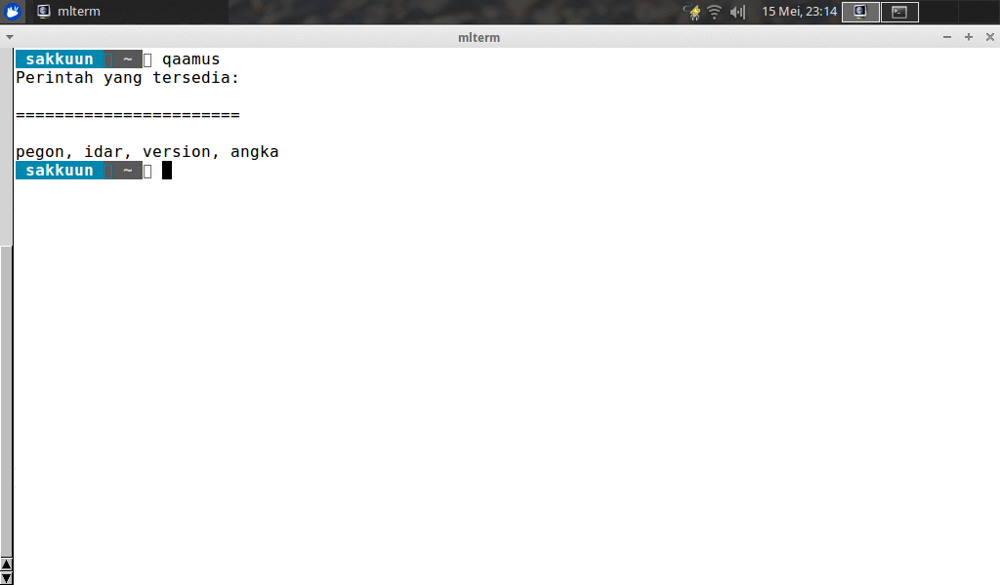

# Qaamus
> Commandline untuk terjemah indo-arab

> Tested at python2.7 and python3.5

Sebuah commandline untuk terjemah kata indonesian-arabic, melalui web [qaamus.com](http://qaamus.com).



## Instalasi

```sh
sudo pip install qaamus
```

## Penggunaan
### Daftar Perintah
Di aplikasi ini, ada 4 perintah yang bisa anda berikan:
* idar
* angka
* pegon
* version

#### `idar`
Adapun `idar`, maka digunakan untuk terjemah indonesia arab melalui alamat [qaamus.com/indonesia-arab.php](http://qaamus.com/indonesia-arab.php)
```sh
qaamus idar [query]
```

#### `angka` dan `pegon`
`angka` = [http://qaamus.com/angka.php](http://qaamus.com/angka.php)

`pegon` = [http://qaamus.com/nama.php](http://qaamus.com/nama.php)
Kedua perintah ini identik, memiliki dua optional sub perintah.
```sh
qaamus angka [-i] [--instruksi] [QUERY]
```
```sh
qaamus pegon [-i] [--instruksi] [QUERY]
```

### Sebagai Modul
* Untuk terjemah indo-arab gunakan `qaamus.idar("query_kamu")`
* Untuk angka gunakan `qaamus.angka("angka_kamu")`
* Untuk pegon gunakan `qaamus.pegon("nama_kamu")`
* Adapun instruksi `qaamus.pegon_instruksi()` atau `qaamus.angka_instruksi()`

Contoh script sederhana:
```python
import qaamus

list_kata = ['keyboard', 'monitor', 'gelas']
list_nama = ['surabaya', 'suratman', 'bekasi']
list_angka = ['123', '3333', '5567']

for kata in list_kata:
    idar = qaamus.idar(kata)
    print(idar)

for nama in list_nama:
    nama = qaamus.pegon(nama)
    print(nama)

for angka in list_angka:
    angka = qaamus.angka(angka)
    print(angka)
```

## Testing
Untuk keperluan testing, maka anda butuh untuk menginstall `tox` dahulu dengan mengetikkan perintah `pip install tox`.

Kemudian, jalankan `tox` dan tunggu sampai selesai. Ini akan menge-test qaamus untuk dipakai di python2.7 dan python3.5. *Feel free* untuk membuat kompabilitas untuk versi python yang lain.

*Ups*, kalau anda perhatikan, akan ada pesan error yang anda dapatkan yang memberitahukan bahwa assertion tidak sama. Maka, jalankan script `fix_next_links_url.py` yang berada dalam folder `html`. **Gunakan python3 untuk menjalankan file ini**

## Riwayat Rilis
* 2.0.1
   * Menghilangkan warning dari BeautifulSoup
* 2.0
   * Qaamus dengan wajah baru
* 1.0

## Tips
* Untuk RTL yang lebih optimal, disarankan agar anda menginstall mlterm
  * Debian: `sudo apt-get install mlterm`

## Meta
Muhammad Ihfazhillah -[madingbengkelku](http://www.facebook.com/madingbengkelku) mihfazhillah@gmail.com

[@ihfazhillah](http://github.com/ihfazhillah)
